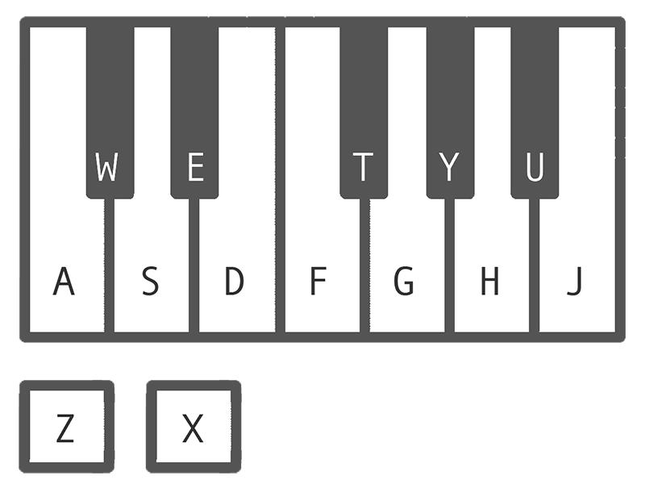

*A software synth (WORK IN PROGRESS)*

Wobbler is a software synth. At the moment, don't bother downloading it, as it's in a heavy state of development.

Some of the features that are currently implemented: 
* User selectable waveforms (sine, square, sawtooth, triangle)
* Detune
* FM synthesis
* ADSR (Well, attack and release)
* Low pass filter
* LFO for lowpass filter cutoff
* MIDI note input

Wobbler is a GUI for Mick Grierson's [Maximilian](https://github.com/micknoise/Maximilian), a C++ DSP and synthesis library. However, due to some bugs in Maximilian's library, synthesis functions will be rewritten from scratch for wobbler (at some point).

## Dependencies 
* SDL2
* rtaudio
* rtmidi 

## What is Wobbler for?
In short, it is to enable quick experimentation with synthesis parameters, in a way that mimics the experience of a hardware synth.

## How to use Wobbler
* Compile
* Connect MIDI keyboard
* Tweak the (unlabeled) parameters until you find a sound you like

# Controls

## MIDI
Notes can be played by connecting a MIDI keyboard to your computer before starting Wobbler, changing synth parameters via CC will be added soon.

## GUI
Currently the GUI controls aren't labeled, however, here is a reference:

| Carrier waveform | Carrier detune | Modulator waveform | Carrier/modulator ratio | Attack time | Release time | Cutoff frequency | LFO rate |
|------------------|----------------|--------------------|-------------------------|-------------|--------------|------------------|----------|

## Computer Keyboard
If you don't have a MIDI keyboard, you can use your computer's keyboard to play notes and change octave:

## Command line
Additionally, the synth can be controlled via the command line, below is a list of commands:

| Command name | Arguments | Description                |
|--------------|-----------|----------------------------|
| rand         | n/a       | Randomise synth parameters |
| quit         | n/a       | Quit the program           |

## Notes
* Sometimes notes will randomly be dropped, especially when notes are played very fast. This is due to a bug in Maximilian's envelope function. Currently there is little that can be done about this, however, eventually Maximilian's synthesis functions will be replaced by custom Wobbler specific functions, remedying this issue.
